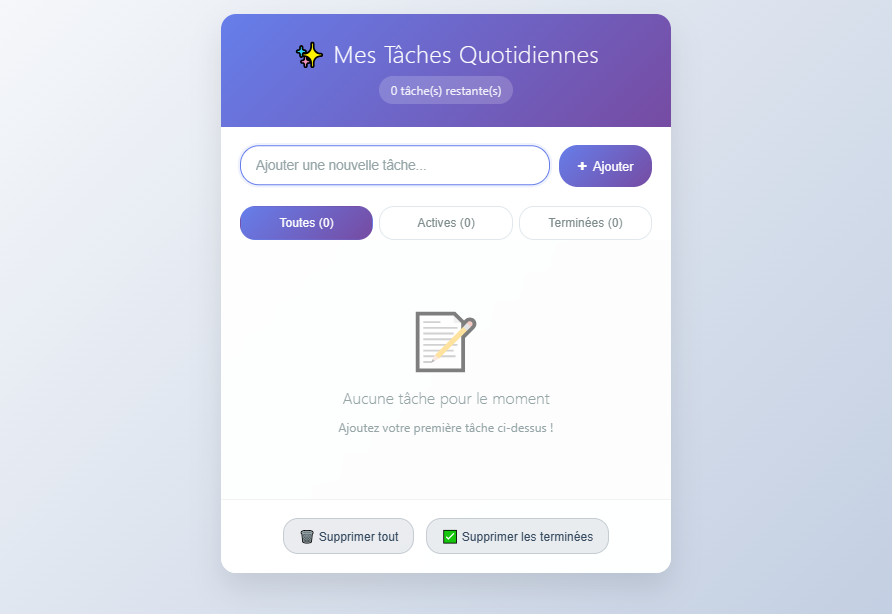

# 📝 Todo List

Une application simple de gestion de tâches en JavaScript vanilla.

## Aperçu



## ✨ Fonctionnalités

- ✅ Ajouter/supprimer des tâches
- 🔄 Marquer comme terminé
- 🔍 Filtrer par statut (toutes/actives/terminées)
- 📊 Compteur de tâches en temps réel

## 🚀 Utilisation

1. Clonez le repo :
```bash
git clone https://github.com/username/todo-list.git
```

2. Ouvrez `index.html` dans votre navigateur

## 🛠️ Technologies

- HTML5
- CSS3
- JavaScript (ES6+)

## 📁 Structure

```
├── index.html
├── styles.css
├── script.js
└── README.md
```

---

⭐ **Donnez une étoile si ce projet vous a plu !**